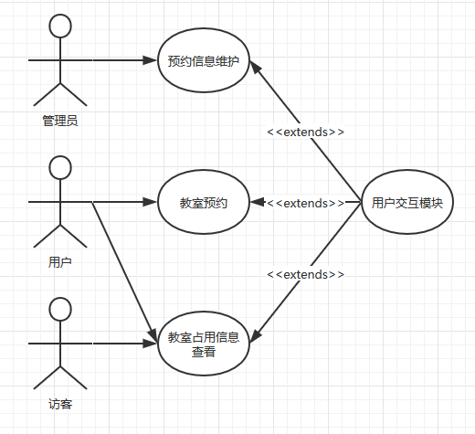
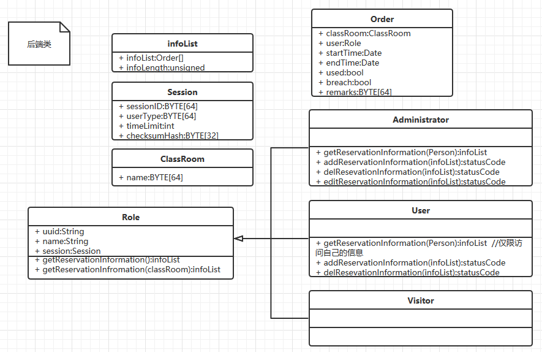
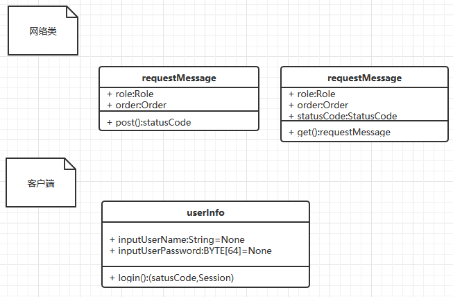

# 软件总体设计说明书

## 关键词
教室租借、 c/s、MVC

## 摘要

该说明书描述了一个教室租用系统的架构，本架构致力于构建一个高可用性的、用户友好的、稳定的教室租用系统。

使用了c/s架构、MVC架构

使用UML作为指导语言

## 缩略语说明：

|缩略语|英文全名|中文解释|备注|
|------|--------|--------|----|
|uuid|Universally Unique Identifier|通用唯一识别码| 不可更改 |
|id|Identifier|用户id| |
|identify|Identify|用户类型| |
|name|Name|用户名| |
|passwd|Password|用户密码| 哈希值（32-bit md5） |

## 参考资料

* [项目地址](https://github.com/HanyuuFurude/LeaderMeiSaveTheWorld)

## 引言

### 目的

<!-- 说明本设计是为了满足软件需求规格说明书中的哪些需求而做的，指明读者对象。 -->
该说明书描述了一个教室租用系统的架构、满足客户要求的的各项需求（包括但不限于：实时性需求、用户量、并发量需求、灾备、安全需求、可重用性、质量属性）面向所有利益相关者、撰写此文档。

### 范围

<!-- 说明文档所包括的内容。 -->
本文包括系统概述、用户需求概述等，简述了该系统的总体构成和工作流程、性能指标和其他需求。

## 总体概述

### 指标描述

<!-- 说明本系统或模块所实现的详细指标 -->
* 平均宕机时间不超过99.9%
* 承受并发量500以下的负载
* 工作时间7*18h（6小时下线时间、可用于备份、维护、整理、故障恢复和磁盘优化）
* 用户操作到反馈的时间不高于5s

### 本系统上下文说明

#### 软件结构

<!-- 简要说明本系统与外部软件系统的上下文关系，表示方法可以采用结构图、数据流图、UML等。目的是为了描述本系统与外部系统的交互关系。 -->
本系统与客户方已有的用户数据库对接，对方数据库使用MySQL，表结构如下：
|uuid(master key)|id|identity|name|password(hash)|
|--|--|--|--|--|
|BYTE[64]|BYTE[64]|STRING[64]|STRING[16]|BYTE[32]|

| classRoom(master key) | user     | startTIme | endTime | used | breach | remarks  |
| --------------------- | -------- | --------- | ------- | ---- | ------ | -------- |
| BYTE[64]              | BYTE[64] | DATE      | DATE    | bool | bool   | BYTE[64] |

#### 硬件结构(可选)

<!-- 此处着重说明本系统依附的硬件架构，对于非驱动类软件模块，本节可以省略。
这里的描述格式不做更细的约定，由设计人员自行把握。 -->
x86-64单服务器

150Mbps上下行带宽

### 设计约束

#### 遵循标准（可选）

<!-- 描述本系统所遵循的标准、规范。 -->
代码规范遵循[阿里巴巴开源代码规范]()
<!-- TODO:补上链接 -->

#### 硬件约束（可选）

<!-- 描述本软件系统实现的硬件约束，比如，对内存的限制等。这是对硬件结构的补充，前面可以说明硬件的总体框架，功能框图。这儿着重讲解硬件对软件的限制，比如不提供某种信号导致软件设计中需要注意的地方或者说限制。 -->
* 可用上行带宽150Mbps
* 可用下行带宽150Mbps
* 外存空间1T
* 内存32G
* CPU16 core

#### 其他约束

<!-- 描述本软件系统设计时需要遵循的其它约束。 -->
需要数据持久化方面的支持、，保存最近90日内写操作记录

不允许明文保存密码

要求所有参数均可以通过配置文件修改

允许数据迁移

### 其他

<!-- 描述其他有关的设计考虑。 -->
有防止SQL注入攻击、DDOS的能力

有完善的日志系统

## 软件总体结构

### 分解视图

#### 分解说明

<!-- 提供本系统（模块）的内部结构图并加以描述。这里其实是提供了本系统的一个分解视图，一个系统一般就是由一个个实体（可以是子模块、数据等）构成。这里，就是请大家将这个分解视图描述清楚，可以使用层次分解图加自然语言的形式加以描述（但不限于此描述方法）。分解的结果就是能够清晰地看出本系统由哪些实体组成，以及这些实体间的关联关系。 -->

#### 各实体说明

<!-- 简要说明上述分解视图中各个实体的功能。 -->

*   Role
    *   用户角色的抽象类，用来描述用户的共有属性和操作
        *   用户角色有uuid、name、session属性分别对应用户唯一标识号、昵称和会话id信息
    *   Administrator
        *   管理员账号，拥有按人查询和按房间查询详情（所有订单信息）的权限、拥有对所有订单的增删操作
    *   User
        *   学生和教师账号，拥有按人（仅限自己）和房间查询占用（是否占用）的权限，拥有对自己的订单的增删操作
    *   Visitor
        *   访客账号，拥有房间查询占用（是否占用）的权限
*   InfoList
    *   封装的订单列表，拥有一个订单数组和数组长度信息
*   Order
    *   订单信息，包含以下属性
        *   classRoom教室对象
        *   user用户对象
        *   startTime开始租借时间
        *   endTime结束租借时间
        *   used是否被使用
        *   breach是否违约
        *   remarks备用信息字段
*   Session
    *   表示活动会话
        *   sessionID:每次成功登陆后下发的会话标识码
*   ClassRoom
    *   教室标识符
        *   name:标识符
*   RequestMessage
    *   （从用户视角而言）发送订单信息，通过接口发送一个该对象即可
        *   数据成员
            *   role:用户角色，表示请求提供方身份标识信息
            *   order:订单信息，表示请求方请求的订单
        *   成员函数
            *   post:调用发送接口，订单信息构造完成后，调用此函数即可提交订单
                *   返回值:statusCode，状态码，用于指示请求结果

#### 初始化 / 配置说明

<!-- 说明本系统的初始化依赖关系，也就是说，本系统需要在哪些系统的初始化之后，才能进行初始化。
简要说明本系统提供了哪些配置项，可以对系统进行相应的配置，以满足不同的产品需求。 -->

### 运行视图

<!-- 说明本系统的初始化依赖关系，也就是说，本系统需要在哪些系统的初始化之后，才能进行初始化。
简要说明本系统提供了哪些配置项，可以对系统进行相应的配置，以满足不同的产品需求。
说明本系统的初始化依赖关系，也就是说，本系统需要在哪些系统的初始化之后，才能进行初始化。
简要说明本系统提供了哪些配置项，可以对系统进行相应的配置，以满足不同的产品需求。-->

### 开发视图

<!-- 描述代码的组织方式。这里只需要说明本系统的目录结构，以及代码的目录（包括公共目录，头文件目录等）分布。这里不需要写出代码具体有多少文件，以及文件名称等，只要归类就可以了。 -->

见上类图

## 接口说明

### 用户接口

<!-- 说明将向用户提供的命令和它们的语法结构，以及响应信息。-->

### 外部接口

<!-- 【1】描述本模块对外提供可以使用的接口说明。接口类型不一定就是函数，可以是API，回调，函数指针，也可以是事件、消息、报文数据、共享内存等。描述形式如：
（1）	接口1: 某个API
必须说明以下内容：
声明：
输入参数描述：
返回值描述：
主要功能描述：描述提供该接口实现的目的；
函数的运行要求：允许在哪个态运行，是否可以重入，以及其他运行要注意的条件。
（2）	接口2:某个消息
消息类型：
消息参数：
消息目的：描述该消息的含义和作用
实现方法：描述该消息如何提供，或者说外部如何得到该消息。
. . . . . .
[说明：对于一些涉及到临界区操作的接口，一定要注意加以说明。]

【2】需要外部提供的接口描述 -->

## 各功能实体与处理流程说明

<!-- 如果本设计文档包括好几个相对大的功能模块，则本章可以细分为几章进行描述，这个时候本章的标题可以是“模块1各功能实体与处理流程说明”，下一章的标题依此类推。-->

### 全局数据结构定义与说明

<!-- 描述本系统定义的全局的以及主要的数据结构。-->

### 主要数据结构之间的关系

<!-- 如果有多个数据结构，请说明它们之间的组织关系。
建议使用图表的形式说明。
如果结构比较简单，那么文字说明要简洁易懂。-->

### 各功能实体以及处理流程说明

#### 功能实体1

<!-- 功能1的处理流程说明，可以使用流程图、UML等方法进行描述。
说明如何实现这些功能，每个步骤是怎样实现的。
可根据功能再进行细分子实体进行描述。

这里有一点需要说明的是：如果本功能实体不再进行进一步分解的总体设计，那么这里必须描述本功能实体对外提供的接口，格式同4.2节 -->

### 功能实体2

## 出错处理设计

### 出错信息

<!-- 用一览表的方式说朗每种可能的出错或故障情况出现时，系统输出信息的形式、含意及处理方法。 -->

### 出错处理设计

<!-- 说明系统出错时处理方法，如：数据自动备份、副本的建立和启动、数据恢复和重启技术等。 -->

### 系统维护设计

<!-- 说明为了系统维护的方便而在程序内部设计中作出的安排，包括在程序中专门安排用于系统的检查与维护的检测点和专用模块。 -->

## 开发环境说明
<!-- 说明本系统的开发环境和开发工具等，有何特别的说明和建议。-->

## 其他

<!-- 其它需要说明的。-->

