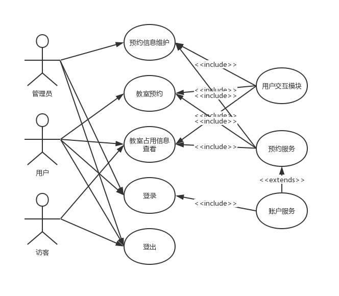
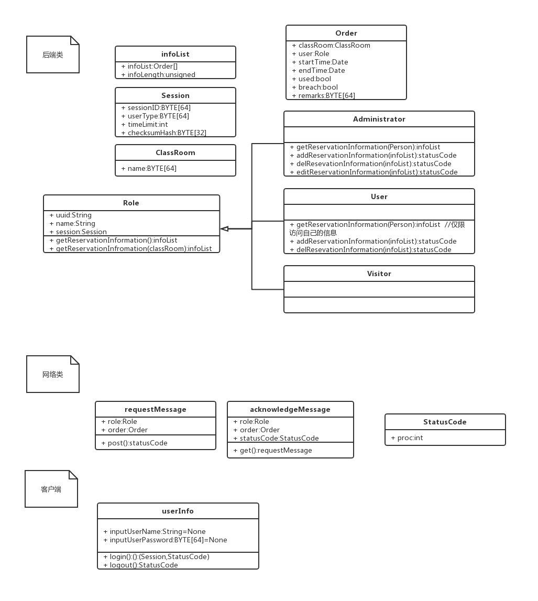

# 软件总体设计说明书

## 关键词
教室租借、 c/s、MVC

## 摘要

该说明书描述了一个教室租用系统的架构，本架构致力于构建一个高可用性的、用户友好的、稳定的教室租用系统。

使用了c/s架构、MVC架构

使用UML作为指导语言

## 缩略语说明：

|缩略语|英文全名|中文解释|备注|
|------|--------|--------|----|
|uuid|Universally Unique Identifier|通用唯一识别码| 不可更改（数据库里标识主键的标识码） |
|id|Identifier|用户id| 用于登录（登录框的用户名） |
|identify|Identify|用户类型| 表示用户类型（在客户端上显示的用户名） |
|name|Name|用户名| 昵称 |
|passwd|Password|用户密码| 哈希值（32-bit md5） |
|sess|Session|用户会话id| 全局唯一 |

## 参考资料

* [项目地址](https://github.com/HanyuuFurude/LeaderMeiSaveTheWorld)

## 引言

### 目的

该说明书描述了一个教室租用系统的架构、满足客户要求的的各项需求（包括但不限于：实时性需求、用户量、并发量需求、灾备、安全需求、可重用性、质量属性）面向所有利益相关者、撰写此文档。

### 范围

本文包括系统概述、用户需求概述等，简述了该系统的总体构成和工作流程、性能指标和其他需求。

## 总体概述

### 指标描述

* 平均宕机时间不超过99.9%
* 承受并发量500以下的负载
* 工作时间7*18h（6小时下线时间、可用于备份、维护、整理、故障恢复和磁盘优化）
* 预约时间
* 用户操作到反馈的时间不高于7s

### 本系统上下文说明

#### 软件结构

本系统与客户方已有的用户数据库对接，对方数据库使用MySQL，表结构如下：

*   用户信息表
*   User Info Tabel

|uuid(master key)|id|identity|name|password(hash)|
|--|--|--|--|--|
|CHAR[64]|BYTE[64]|VARCHAR[64]|VARCHAR|CHAR[32]|

*   日志记录表（两份，一份记录当日往前7日（含当日）的日志，另一份存历史日志）
*   Log Tabel

| classRoom(master key) | uuid     | startTIme | endTime | used | breach | remarks  |
| --------------------- | -------- | --------- | ------- | ---- | ------ | -------- |
| CHAR[64]              | CHAR[64] | DATE      | DATE    | bool | bool   | CHAR[64] |

#### 硬件结构

x86-64单服务器

150Mbps上下行带宽Mbps

### 设计约束

#### 遵循标准

代码规范遵循[阿里巴巴开源代码规范]()

### 硬件约束

* 可用上行带宽150Mbps
* 可用下行带宽150Mbps
* 外存空间1T
* 内存32G
* CPU16 core

## 其他约束

*   需要数据持久化方面的支持、，保存最近90日内写操作记录
*   不允许明文保存密码
*   有防止SQL注入攻击、DDOS的能力
*   有完善的日志系统
*   要求所有参数均可以通过配置文件修改
*   允许数据迁移

### 其他

*   商业原则
    *   高性价比
    *   受控的信息管理
    *   事物持续性
    *   兼容其他软件和操作系统
    *   知识产权保护
    *   7x24运维支持
    *   符合相关法律
*   数据原则
    *   数据资产保护
    *   数据共享保护
    *   受控数据访问
    *   可靠数据托管
    *   容易理解的数据定义和词汇
    *   数据安全性保证
*   应用程序原则
    *   技术无关
    *   易用
*   技术原则
    *   容许一定限度内的需求变化
    *   快速响应变更管理
    *   互操作性强
    *   控制技术多样
*   遵循关注点分离原则
*   遵循单一职责原则
*   遵循LoD原则

## 软件总体结构

### 分解视图

#### 分解说明

#### 各实体说明

见 [类和实体文档](./class.md)

#### 初始化 / 配置说明

 见[部署文档](./deploy.md)

### 运行视图

见上图

### 开发视图

见上图

## 接口说明

### 用户接口

见[接口文档](./interface.md)

### 外部接口

见[接口文档](./interface.md)

## 各功能实体与处理流程说明

### 数据结构

见[数据结构文档](./dataStructure.md)

### 各功能实体以及处理流程说明

#### 功能实体1

<!-- 功能1的处理流程说明，可以使用流程图、UML等方法进行描述。
说明如何实现这些功能，每个步骤是怎样实现的。
可根据功能再进行细分子实体进行描述。

这里有一点需要说明的是：如果本功能实体不再进行进一步分解的总体设计，那么这里必须描述本功能实体对外提供的接口，格式同4.2节 -->

### 功能实体2

## 出错处理设计

### 出错信息

[见StatusCode文档](./statusCode.md)

### 出错处理设计

-   利用状态码的设计，将所有的状态信息通过状态码处理。
-   每日停止服务后，自动执行备份。
-   所有的状态当日清空记入日志减小系统运行开销也防止系统频繁读取文本文件，减小出错几率。

### 系统维护设计

-   每日停止服务后，系统将自动执行当日的数据归档维护工作
-   待自动维护完成后，管理员可以对历史数据（日志文件）进行增量式备份
-   若要迁移数据，只需重新设置数据库位置即可运行，若需要迁移日志也可一并迁移
-   建议使用raid磁盘阵列储存数据库和日志以减轻硬盘故障带来的损害
-   建议使用windows的还原点功能进行备份

## 开发环境说明

*   本项目依托于windows平台
*   本项目基于java构建，兼容java11，12（其他版本尚未测试）
*   本项目由maven进行包管理
*   本项目的版本控制由git管理，使用github作为远程git服务端。

## 其他

*   暂无

