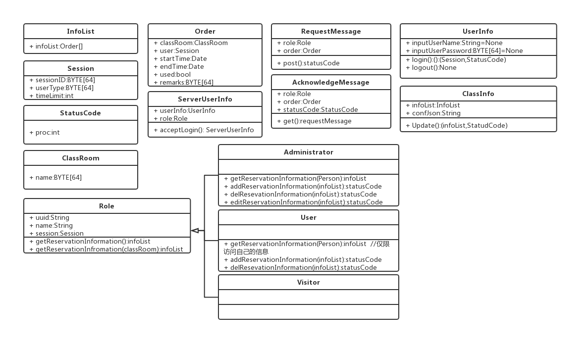

# 架构设计

## 项目名称：教室预约系统

[TOC]


## 引言

本文档是教师预约系统的需求分析文档，

### 编写目的

受甲方xxx委托，为甲方单位开发教室预约系统一套。用于师生快速预约教室之用。

### 项目风险

*   系统不能按期交付
*   系统不能按预期运行
*   系统可能会导致甲方数据库故障

## 设计概述

### 限制和约束

-   技术栈
    -   Java 8
    -   MySQL 8
    -   Windows 10 x64
-   编码规范
    -   阿里Java开发手册1.3.0
-   硬件限制
    -   500GB储存空间
    -   20GB内存空间
    -   100Mbps上下行带宽
    -   数据库
        -   账户数据库为甲方学校提供的数据库
    -   用户
        -   所有用户的账户都储存于甲方学校数据库中，且不需要注册和销户功能
    -   工期约束
        -   28个自然日
    -   设备约束
        -   500GB储存空间
        -   20GB内存空间
        -   100Mbps上下行带宽

### 设计原则和要求

-   商业原则
    -   高性价比
    -   受控的信息管理
    -   事物持续性
    -   兼容其他软件和操作系统
    -   知识产权保护
    -   7x24运维支持
    -   符合相关法律
-   数据原则
    -   数据资产保护
    -   数据共享保护
    -   受控数据访问
    -   可靠数据托管
    -   容易理解的数据定义和词汇
    -   数据安全性保证
-   应用程序原则
    -   技术无关
    -   易用
-   技术原则
    -   容许一定限度内的需求变化
    -   快速响应变更管理
    -   互操作性强
    -   控制技术多样
-   遵循关注点分离原则
-   遵循单一职责原则
-   遵循LoD原则

## 系统逻辑设计

### 系统组织设计

| 子系统编号 | 名称       | 业务职能                                                     | 安装地点           | 备注 |
| ---------- | ---------- | ------------------------------------------------------------ | ------------------ | ---- |
| 1          | 客户端系统 | 与客户交互，负责向用户提供登陆、查询和预约操作界面           | 客户端、客户机     |      |
| 2          | 服务端系统 | 接收客户端的数据并进行合法性验证、对比数据库的数据完成用户发起的操作并下发结果 | 服务端、生产服务器 |      |
| 3          | 数据库系统 | 提供账户信息读取和订单信息读写                               | 服务端、数据服务器 |      |
| 4          | 日志系统   | 提供系统日志                                                 | 服务端、所有服务器 |      |

### 系统结构设计



#### 系统特性表

*   子系统编号：1

*   子系统名称：客户端系统

*   特性
    *   特性编号：0
        *   操作功能：验证用户填写的用户名和密码符合形式正确
        *   调用对象： 事件系统和登录按钮
        *   被调用对象：登录ux系统
    *   特性编号：1
        *   操作功能：将用户名密码md5值通过网络发送
        *   调用对象： 事件系统和登录按钮
        *   被调用对象：登录ux系统、网络模块
    *   特性编号：2
        *   操作功能：向服务端查询教室占用情况并更新ui系统
        *   调用对象：事件系统
        *   被调用对象：登录ux系统、网络模块
    *   特性编号：3
        *   操作功能：向服务端发送订单信息
        *   调用对象：用户
        *   被调用对象：订单ux系统、网络模块

*   子系统编号：2

*   子系统名称：服务端系统

*   特性

    *   特性编号：1
        *   操作功能：验证登陆
        *   调用对象：网络监听触发事件
        *   被调用对象：登陆验证模块、数据库
    *   特性编号：2
        *   操作功能：订单处理
        *   调用对象：网络监听触发事件
        *   被调用对象：订单冲突检测模块、数据库
    *   特性编号：3
        *   操作功能：占用查询
        *   调用对象：网络监听触发事件
        *   被调用对象：订单冲突检测模块、订单写入模块、数据库

*   子系统编号：3

*   子系统名称：数据库

*   特性

    *   特性编号：1
        *   操作功能：账号信息查询
        *   调用对象：服务端
        *   被调用对象：数据库
    *   特性编号：2
        *   操作功能：订单查询
        *   调用对象：服务端
        *   被调用对象：数据库
    *   特性编号：3
        *   操作功能：订单增加
        *   调用对象：服务端
        *   被调用对象：数据库

*   子系统编号：4

*   子系统名称：日志系统

*   特性

    *   特性编号：1
        *   操作功能：日志记录
        *   调用对象：服务端、数据库
        *   被调用对象：日志系统

    

#### 系统特性结构图


### 系统接口设计

#### 系统接口表

| 序号 | 名称        | 功能                       |
| ---- | ----------- | -------------------------- |
| 0    | login       | 客户端发起登录请i去        |
| 1    | logout      | 客户端执行登出操作         |
| 2    | update      | 客户端请求更新教室占用信息 |
|      | post        | 向服务器提交一个订单       |
|      | acceptLogin | 服务器接受登录             |
|      | get         | 服务器得到一个订单         |


## 系统出错处理设计

### 系统出错处理表

#### 状态码

-   0x0000
    -   操作成功（无异常）
-   0x0001
    -   网络失败（网络连接异常）[附录0000](#0000)
-   0x0002
    -   找不到服务器（网络连接正常但是服务器无法访问）[附录0000](#0000)
-   0x0003
    -   服务不可用（服务器能ping通但是网络接口不响应）
-   0x0004-0x000f
    -   预留
-   0x0010
    -   登陆失败：账号密码填写错误
-   0x0011
    -   登录超时：会话连接已超时
-   0x0012
    -   账号异常：账号信息异常，请重新登录[附录0003](#0003)
-   0x0013
    -   要求登录：请登录[附录0001](#0001)
-   0x0014
    -   权限不足：权限不足[附录0002](#0002)
-   0x0015
    -   操作失败：预约冲突，房间已经被预约
-   0x0016
    -   操作失败：预约失败，请求预约的信息不合法
-   0x0017
    -   操作失败，频繁登录
-   0x0018-0x001f
    -   预留
-   0x0020
    -   服务不可用：服务器正在维护，暂停提供预约服务
-   0x0021
    -   不在服务时间内：不在服务时间内，不提供预约服务

#### 附加说明

*   ###### 0000

关于返回```0x0001```和```0x0002```的区别：当发现连接错误时，请先尝试ping一下网址：

-   https://www.baidu.com
-   https://www.bing.com
-   https://www.google.com

ping设置，每个网址ping 4次，超时5000ms，如果至少有一次成功，应当返回```0x0002```，否则返回```0x0001```

*   ###### 0001

当前仅当用户为visitor并且尝试预约时，返回该状态码，此时服务端应该提示需要登陆并打开登陆界面

*   ###### 0002

发现提交的操作不符合账户权限，防止用户使用非正常操作方式（比如爬虫等）使用当前用户尝试操作当前等级不允许操作的操作，则返回此状态码

*   ######  0003

发现会话信息和用户信息不匹配，防止用户使用非正常操作方式（比如爬虫等），构造不合法的身份信息


### 维护处理过程表

-   每日停止服务后，系统将自动执行当日的数据归档维护工作
-   待自动维护完成后，管理员可以对历史数据（日志文件）进行增量式备份
-   若要迁移数据，只需重新设置数据库位置即可运行，若需要迁移日志也可一并迁移
-   建议使用raid磁盘阵列储存数据库和日志以减轻硬盘故障带来的损害
-   建议使用windows的还原点功能进行备份

## 数据库设计

本系统与客户方已有的用户数据库对接，对方数据库使用MySQL，表结构如下：

*   用户信息表
*   User Info Tabel


| uuid(master key) | id       | identity    | name    | password(hash) |
| ---------------- | -------- | ----------- | ------- | -------------- |
| CHAR[64]         | BYTE[64] | VARCHAR[64] | VARCHAR | CHAR[32]       |


*   日志记录表（两份，一份记录当日往前7日（含当日）的日志，另一份存历史日志）
*   Log Table

| classRoom(master key) | uuid     | startTIme | endTime | used | breach | remarks  |
| --------------------- | -------- | --------- | ------- | ---- | ------ | -------- |
| CHAR[64]              | CHAR[64] | DATE      | DATE    | bool | bool   | CHAR[64] |

## 词汇表

| 缩略语   | 英文全名                      | 中文解释       | 备注                                   |
| -------- | ----------------------------- | -------------- | -------------------------------------- |
| uuid     | Universally Unique Identifier | 通用唯一识别码 | 不可更改（数据库里标识主键的标识码）   |
| id       | Identifier                    | 用户id         | 用于登录（登录框的用户名）             |
| identify | Identify                      | 用户类型       | 表示用户类型（在客户端上显示的用户名） |
| name     | Name                          | 用户名         | 昵称                                   |
| passwd   | Password                      | 用户密码       | 哈希值（32-bit md5）                   |
| sess     | Session                       | 用户会话id     | 全局唯一                               |

## 进度计划

*   week1
    *   项目分析、需求分析
*   week2
    *   架构分析、技术选型、原型开发
*   week3
    *   项目演进，文档演进
*   week4
    *   项目基本完成、文档演进、准备交付