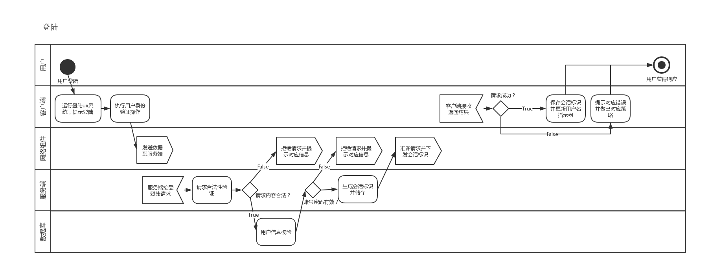
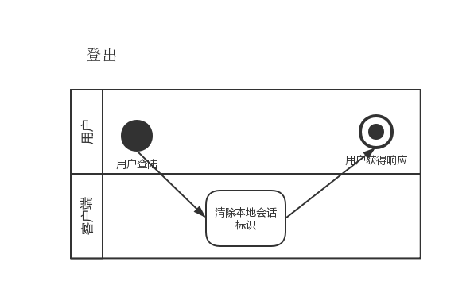
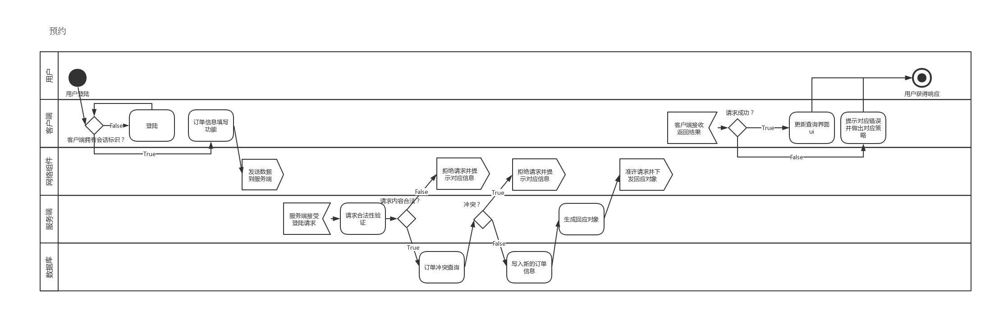

# 详细设计

## 项目名称：教室预约系统

[TOC]

## 引言

本文档是教室预约系统的需求分析文档，

### 编写目的

受甲方xxx委托，为甲方单位开发教室预约系统一套。用于师生快速预约教室之用。

### 项目风险

-   系统不能按期交付
-   系统不能按预期运行
-   系统可能会导致甲方数据库故障

## 支撑环境

-   Windows 10 x86-64
-   本项目基于java构建，兼容java11，12（其他版本尚未测试）
-   本项目由maven进行包管理
-   本项目的版本控制由git管理，使用github作为远程git服务端。

### 数据库管理系统

*   MySQL 8

### 开发工具、中间件和数据库接口

*   开发工具
    *   Java 8
    *   Maven 2.8
    *   JetBrains Intellij IDEA 201901
    *   Visual Code 1.33
    *   Eclipse 4.5
    *   Typora 0.9
    *   MySQL Community 8
    *   MySQL WorkBench 8
*   中间件
    *   无
*   数据库接口
    *   MySQL ODBC

### 硬件环境

-   服务端：刀片式架构服务器一台
-   客户端：x86-64 x86 arm架构的计算设备

### 网络环境

100Mbps上下行带宽

## 部件详细设计

## 词汇表

| 缩略语   | 英文全名                      | 中文解释       | 备注                                   |
| -------- | ----------------------------- | -------------- | -------------------------------------- |
| uuid     | Universally Unique Identifier | 通用唯一识别码 | 不可更改（数据库里标识主键的标识码）   |
| id       | Identifier                    | 用户id         | 用于登录（登录框的用户名）             |
| identify | Identify                      | 用户类型       | 表示用户类型（在客户端上显示的用户名） |
| name     | Name                          | 用户名         | 昵称                                   |
| passwd   | Password                      | 用户密码       | 哈希值（32-bit md5）                   |
| sess     | Session                       | 用户会话id     | 全局唯一                               |

## 进度计划

-   week1
    -   项目分析、需求分析
-   week2
    -   架构分析、技术选型、原型开发
-   week3
    -   项目演进，文档演进
-   week4
    -   项目基本完成、文档演进、准备交付