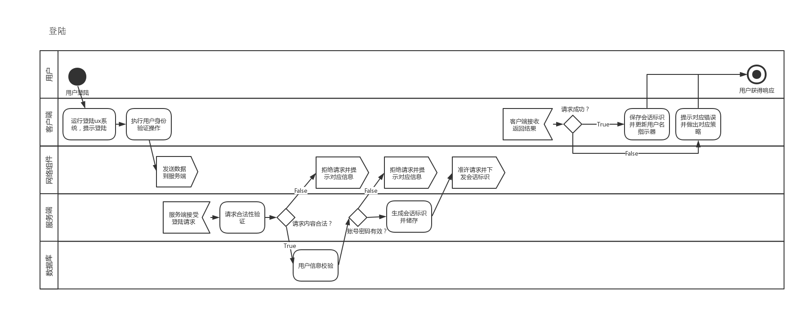
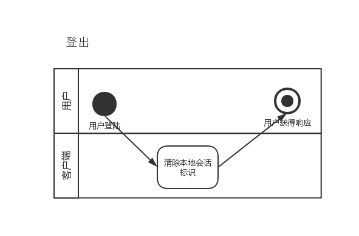
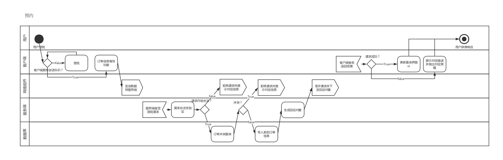
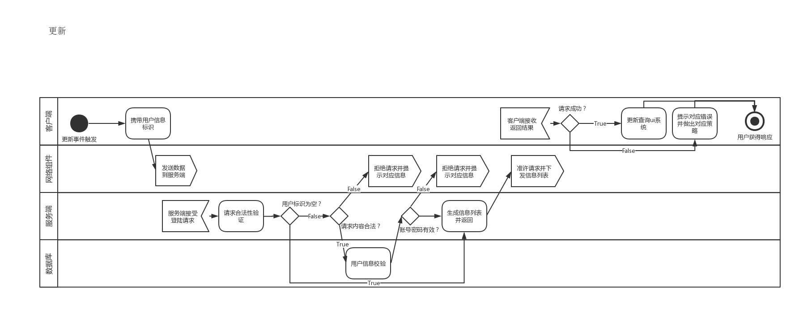

# 	需求分析

## 项目名称：教室预约系统

[TOC]

## 引言

本文档是教室预约系统的需求分析文档，

### 编写目的

受甲方xxx委托，为甲方单位开发教室预约系统一套。用于师生快速预约教室之用。

### 项目风险

*   系统不能按期交付
*   系统不能按预期运行
*   系统可能会导致甲方数据库故障

### 产品范围

*   教室预约客户端程序一套
*   教室预约服务端程序一套
*   说明文档一套
    *   需求分析文档一份
    *   架构设计文档一份
    *   详细设计文档一份
    *   其他附加文档

### 文档约定

| 缩略语   | 英文全名                      | 中文解释       | 备注                                   |
| -------- | ----------------------------- | -------------- | -------------------------------------- |
| uuid     | Universally Unique Identifier | 通用唯一识别码 | 不可更改（数据库里标识主键的标识码）   |
| id       | Identifier                    | 用户id         | 用于登录（登录框的用户名）             |
| identify | Identify                      | 用户类型       | 表示用户类型（在客户端上显示的用户名） |
| name     | Name                          | 用户名         | 昵称                                   |
| passwd   | Password                      | 用户密码       | 哈希值（32-bit md5）                   |
| sess     | Session                       | 用户会话id     | 全局唯一                               |

## 综合描述

### 产品状况

该系统依托于甲方学校现有师生信息数据库，增加教室预约功能，是甲方师生信息系统中的一个全新的模块。

### 产品功能

该系统为师生提供一个教室预约信息查询、预约的应用程序。

用户使用自己在甲方学校已有的账户进行登录。提供查询并选择空余教室并预约的功能。

*   登录功能

    *   使用者：甲方学校师生
    *   描述： 使用者使用自己在该学校的账号密码作为身份标识在客户端上进行登录的功能

*   登出功能

    *   使用者：甲方学校师生
    *   描述： 使用者撤销自己在客户端上的登陆标识的功能

*   查询功能

    *   使用者：甲方学校师生

    *   描述：使用者在客户端上查询可预约教室的功能^*^

        <small>^*^若在进行此功能前用户已完成登陆功能、此功能会指示使用者预约的教室</small>

*   预约功能

    *   使用者：甲方学校师生
    *   描述：使用者在登陆后，在客户端上预约可用时间段内未被预约的教室的功能

### 运行环境

#### 硬件平台

*   服务端：刀片式架构服务器一台
*   客户端：x86-64 x86 arm架构的计算设备

#### 操作系统和版本

*   服务器：Windows 10 x64 with java 8
*   客户端：能运行java 8 jre的操作系统环境

#### 支撑环境

*   MySQL 8.0.15

### 设计和实现限制

*   技术栈
    *   Java 8
    *   MySQL 8
    *   Windows 10 x64
*   编码规范
    *   阿里Java开发手册1.3.0
*   硬件限制
    *   500GB储存空间
    *   20GB内存空间
    *   100Mbps上下行带宽

### 假设和约束

*   数据库
    *   账户数据库为甲方学校提供的数据库
*   用户
    *   所有用户的账户都储存于甲方学校数据库中，且不需要注册和销户功能
*   工期约束
    *   28个自然日
*   设备约束
    *   500GB储存空间
    *   20GB内存空间
    *   100Mbps上下行带宽

## 外部接口需求

### 用户界面

### 硬件接口

*   使用平台ui默认风格
*   使用标准ui库
*   ux系统包含如下三个ux组件
    *   登录ux系统
    *   查询ux系统（主系统）
    *   预约ux系统
*   通讯协议
    *   socket

### 软件接口

*   操作系统
    *   windows 10 x64
*   数据库
    *   MySQL
*   工具
    *   开发工具
        *   Java 8
        *   Maven 2.8
        *   JetBrains Intellij IDEA 201901
        *   Visual Code 1.33
        *   Eclipse 
        *   Typora 0.9
        *   MySQL Community 8
        *   MySQL WorkBench 8
    *   部署工具
        *   7z
    *   运维工具
        *   RDP
*   函数库
    *   Java stand library
    *   Netty
    *   Swing

### 通讯接口

*   Java sockect
*   传输格式
    *   object（详细消息格式见附录）
    *   密码通过md5计算后通过参与通讯

## 系统功能需求

### 说明和优先级

| 优先级 | 功能 | 描述                                                         |
| ------ | ---- | ------------------------------------------------------------ |
| 9      | 登陆 | 使用者使用自己在该学校的账号密码作为身份标识在客户端上进行登录的功能 |
| 3      | 登出 | 使用者撤销自己在客户端上的登陆标识的功能                     |
| 8      | 查询 | 使用者在客户端上查询可预约教室的功能                         |
| 9      | 预约 | 使用者在登陆后，在客户端上预约可用时间段内未被预约的教室的功能 |

### 激励/响应序列

#### 数据结构

本系统与客户方已有的用户数据库对接，对方数据库使用MySQL，表结构如下：

*   用户信息表
*   User Info Tabel

| uuid(master key) | id       | identity    | name    | password(hash) |
| ---------------- | -------- | ----------- | ------- | -------------- |
| CHAR[64]         | BYTE[64] | VARCHAR[64] | VARCHAR | CHAR[32]       |

*   日志记录表（两份，一份记录当日往前7日（含当日）的日志，另一份存历史日志）
*   Log Tabel

| classRoom(master key) | uuid     | startTIme | endTime | used | breach | remarks  |
| --------------------- | -------- | --------- | ------- | ---- | ------ | -------- |
| CHAR[64]              | CHAR[64] | DATE      | DATE    | bool | bool   | CHAR[64] |

## 其他非功能需求

### 性能需求

-   平均宕机时间不超过99.9%
-   承受并发量500以下的负载
-   工作时间7*18h（6小时下线时间、可用于备份、维护、整理、故障恢复和磁盘优化）
-   预约时间
-   用户操作到反馈的时间不高于7s

### 安全措施需求

-   需要数据持久化方面的支持、，保存最近90日内写操作记录
-   不允许明文保存密码
-   有防止SQL注入攻击、DDOS的能力
-   有完善的日志系统

### 软件质量属性

-   要求所有参数均可以通过配置文件修改
-   允许数据迁移

